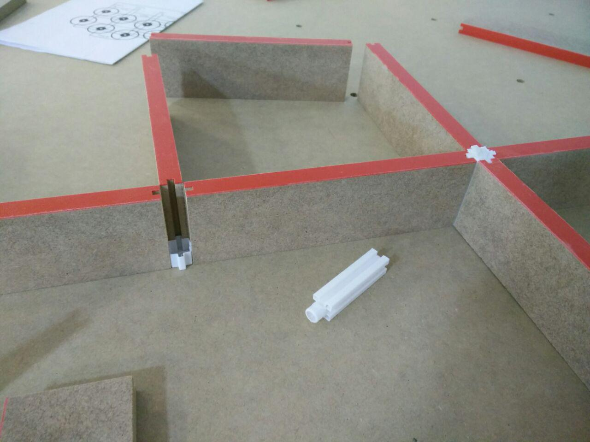

# Diseño de un laberinto para pruebas de micromouse.
NOTA: Este diseño se está probando todavía. Tomad todas las medidas con un espítiu crítico ;-)

Este repositorio contiene los planos para construir un laberinto reconfigurable para pruebas de micromouse. El diseño está adaptado para la normativa de las competiciones como la OSWHDEM (http://rules.oshwdem.org/labirinto_es) o la de Open Robosports (https://github.com/open-robosports/normativa-laberinto).

El laberinto es modular, la base se divide en 3x3 paneles.

Tanto la base como las paredes están hechas en madera. El diseño de las mismas está en el directorio ./wooden_base_walls

Los postes que soportan las paredes están impresos en 3D. El diseño (Freecad + STLs) está en el directorio ./poles_3d_design

# Ya tengo las piezas... cómo hago el laberinto?
Para diseñar el mapa de un laberinto, se puede usar un software como:
- https://github.com/brico-labs/OshwdemMazes/tree/master/src/MazeGenerator

También puedes utilizar buenos mapas hechos por otros:
- https://github.com/micromouseonline/mazefiles
- http://www.tcp4me.com/mmr/mazes/

# Otras referencias
- http://www.micromouseonline.com/micromouse-book/mazes-and-maze-solving/construction/

# Agradecimientos
Gracias a Bulebots (https://github.com/Bulebots) por la inspiración y algunas de las referencias de este README.

Gracias a nuestro carpintero de confianza ;-D, Suso.

# TODO
- Diseños 3D de base y paredes.
- Probar laberinto de 1X2 paneles.
