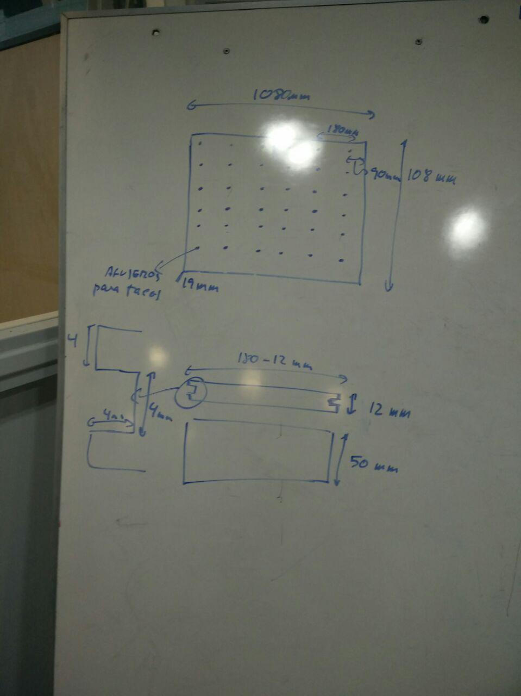
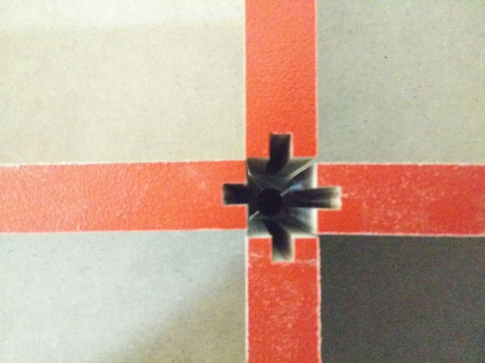
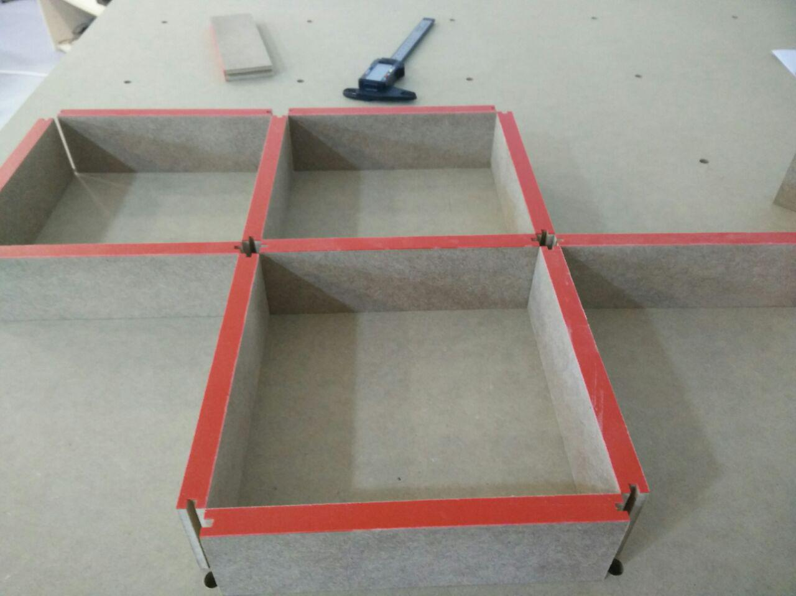

# Base y paredes hechas en madera.

El diseño es el de la siguiente imagen.

Por un lado, se divide el laberinto original (3x3 metros) en 9 cuadrados.

Por otro lado, las paredes tienen una ranura para encajar en los postes.

La base y las paredes se han hecho en madera DM.

